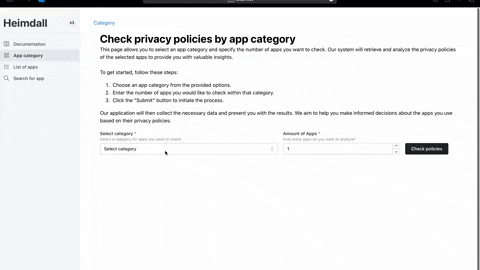

# Evaluating Privacy Policies of Android Apps (IOSL ST 23)


## Description
This software artifacts allows researchers and privacy-aware individuals to automatically check and evaluate the completeness of privacy policies from apps listed in the google play store. 

The frontend allows users to check apps' completeness by category, id, or name and returns a completeness score based on multiple gdpr relevant categories <sup>1</sup>.

The flask-app handles corresponding api calls and orchestrates functions from the submodules webcrawling and nlp. The webcrawling module is responsible for crawling relevant information (id, name, logo_url, privacy_policy) from openly available web-sources. Last, the nlp module receives the privacy policy as an input and returns a score fore each category (1, if the category is present, else 0).

<sup>1</sup> The gdpr-relevant categories and labeled training data are based on: <br>
Rahat, T. A., Long, M., & Tian, Y. (2022, November). Is Your Policy Compliant? A Deep Learning-based Empirical Study of Privacy Policies' Compliance with GDPR. In *Proceedings of the 21st Workshop on Privacy in the Electronic Society* (pp. 89-102).

```
App
│
├── frontend
│   ├── react
├── backend
    ├── flask
        ├── webcrawling
        └── nlp

```
Fig. 1: Simplified architecture. 

## Visuals
The demo shows how a users checks the top 10 apps from the category _dating_ for gdpr compliance.



## Installation using Docker Compose

1. Navigate to the root directory:

```bash
cd IOSL-ST-23
```

2. Build and run the Docker containers:

```bash
docker-compose up --build
```

This will start the Frontend and Backend services as defined in the `docker-compose.yml` file.

## Documentation

### Frontend

### Backend
The documentation for the backend is automatically created based on docstrings using [pdoc3](https://github.com/pdoc3/pdoc). <br> (See [backend docs](backend/docs/src/index.html)).

To update the documentation using pdoc3:

1. Navigate to the Backend directory:

```bash
cd ../backend
```

2. Generate docs in ```/backend/docs/src```:

```bash
pdoc --html --output-dir docs --force src
```

3. Open ```/backend/docs/src/index.html``` in your web-browser of choice.

## Usage
1. Install frontend and backend following the installation guide.
2. Access ```http://localhost:3000``` in your web-browser of choice.
3. Generate a score for the completenes of an android apps' privacy policy via.:

    3.1. The apps' category

    3.2. The apps' id

    3.3. The apps' name

To monitor the crawlers that are using Selenium, you can access the monitoring dashboard by visiting ```http://localhost:4444/ui#/sessions```. 

## Troubleshooting
1. Recreate the frontend and backend container using the installation guide.
2. Make sure that the ports: 3000, 8000, 5900 and 4444 are not used by another service. 
3. Check your internet connection. The web-crawler heavily rely on a stable internet connection to access webpages from androidrank and the google play store.
4. Analyze the logs within the docker container.
5. Check if the structure or links of web-pages has changed. To do so, inspect the ```driver.find_element()``` functions in the source code. 

## Contributing
For contributions please open a pull-request. Future features may include: 
1. Multi-class prediction of privacy policy categories.
2. Text highlighting and matching of sentences with the privacy policies and their corresponding categories.
3. Crawler robustness improvements e.g., creation of variables for crucial html elements for better maintainability. 
4. There is no limit! Test the application, expand and improve it as you please.

## Authors and Acknowledgment
The tool has been developed by master students at TU Berlin at School IV - Electrical Engineering and Computer Science: Department of Telecommunication Systems (Chair of Service-centric Networking).

The following authors contributed to this project:
* [Ahmet Sevim](https://www.linkedin.com/in/sevimahmet/)
* [Daria Seita](https://www.linkedin.com/in/daria-seita-b346b7187/)
* [Furat Hamdan](https://www.linkedin.com/in/furat-hamdan-9b77b8256/)
* [Heyi Li]()
* [Jan Bode](https://www.linkedin.com/in/bode-jan/), and 
* [Richard Detlefs]().

The project was closely supervised and evaluated by Thomas Cory and Prof. Dr. Axel Küpper.

## License
MIT License

Copyright (c) 2023 Heimdall

Permission is hereby granted, free of charge, to any person obtaining a copy
of this software and associated documentation files (the "Software"), to deal
in the Software without restriction, including without limitation the rights
to use, copy, modify, merge, publish, distribute, sublicense, and/or sell
copies of the Software, and to permit persons to whom the Software is
furnished to do so, subject to the following conditions:

The above copyright notice and this permission notice shall be included in all
copies or substantial portions of the Software.

THE SOFTWARE IS PROVIDED "AS IS", WITHOUT WARRANTY OF ANY KIND, EXPRESS OR
IMPLIED, INCLUDING BUT NOT LIMITED TO THE WARRANTIES OF MERCHANTABILITY,
FITNESS FOR A PARTICULAR PURPOSE AND NONINFRINGEMENT. IN NO EVENT SHALL THE
AUTHORS OR COPYRIGHT HOLDERS BE LIABLE FOR ANY CLAIM, DAMAGES OR OTHER
LIABILITY, WHETHER IN AN ACTION OF CONTRACT, TORT OR OTHERWISE, ARISING FROM,
OUT OF OR IN CONNECTION WITH THE SOFTWARE OR THE USE OR OTHER DEALINGS IN THE
SOFTWARE.


