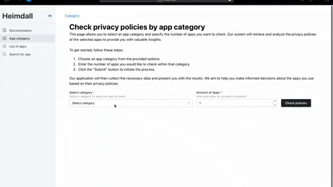

# Evaluating Privacy Policies of Android Apps (IOSL ST 23)


## Description
This software artifacts allows researchers and privacy-aware individuals to automatically check and evaluate the completeness of privacy policies from apps listed in the google play store. 

The frontend allows users to check apps' completeness by category, id, or name and returns a completeness score based on multiple gdpr relevant categories. 

It further allows users to trigger a crawling process to update the database file. Per default, the database crawler crawls the top 20 apps for each category; the corresponding variable _number_apps_per_category_ can be adjusted in ```IOSL-ST-23/backend/src/webcrawling/app_db_crawler.py```.

The flask-app handles corresponding api calls and orchestrates functions from the submodules webcrawling and nlp. The webcrawling module is responsible for crawling relevant information (id, name, logo_url, privacy_policy) from openly available web-sources. Last, the nlp module receives the privacy policy as an input and returns a score fore each category (1, if the category is present, else 0).

The gdpr-relevant categories and labeled training data are based on: \
Rahat, T. A., Long, M., & Tian, Y. (2022, November). Is Your Policy Compliant? A Deep Learning-based Empirical Study of Privacy Policies' Compliance with GDPR. In *Proceedings of the 21st Workshop on Privacy in the Electronic Society* (pp. 89-102).

```
App
│
├── frontend
│   ├── react
├── backend
    ├── flask
        ├── webcrawling
        └── nlp

```
Fig. 1: Simplified architecture. 

## Visuals
The demo shows how a users checks the top 10 apps from the category _dating_ for gdpr compliance.



## Installation using Docker Compose

1. Navigate to the root directory:

```bash
cd IOSL-ST-23
```

2. Build and run the Docker containers:

```bash
docker-compose up --build
```

This will start the Frontend and Backend services as defined in the `docker-compose.yml` file.

## Documentation

### Backend
The documentation for the backend is automatically created based on docstrings using [pdoc3](https://github.com/pdoc3/pdoc). \
(See [backend docs](backend/docs/src/index.html)).

To update the documentation using pdoc3:

1. Create virtual environment:

```bash
python3 -m venv venv
```

2. Activate virtual environment:

    a. Mac: ```source venv/bin/activate```
    b. Windows: ```venv\Scripts\activate```


3. Navigate to the Backend directory:

```bash
cd backend
```

4. Install requirements

```bash
pip install -r requirements.txt
```

5. Generate docs in ```/backend/docs/src```:

```bash
pdoc --html --output-dir docs --force src
```

6. Open ```/backend/docs/src/index.html``` in your web-browser of choice.

## Usage
1. Install frontend and backend following the installation guide.
2. Access ```http://localhost:3000``` in your web-browser of choice.
3. Generate a score for the completenes of an android apps' privacy policy via.:

    3.1. The apps' category

    3.2. The apps' id

    3.3. The apps' name

To monitor the crawlers that are using Selenium, you can access the monitoring dashboard by visiting ```http://localhost:4444/ui#/sessions```. 

## Troubleshooting
1. Recreate the frontend and backend container using the installation guide.
2. Make sure that the ports: 3000, 8000, 5900 and 4444 are not used by another service. 
3. Check your internet connection. The web-crawler heavily rely on a stable internet connection to access webpages from androidrank and the google play store.
4. Analyze the logs within the docker container.
5. Check if the structure or links of web-pages has changed. To do so, inspect the ```driver.find_element()``` functions in the source code. 

## Contributing
For contributions please open a pull-request. Future features may include: 
1. Multi-class prediction of privacy policy categories.
2. Text highlighting and matching of sentences with the privacy policies and their corresponding categories.
3. Crawler robustness improvements e.g., creation of variables for crucial html elements for better maintainability. 
4. There is no limit! Test the application, expand and improve it as you please.

## Authors and Acknowledgment
The tool has been developed by master students at TU Berlin at School IV - Electrical Engineering and Computer Science: Department of Telecommunication Systems (Chair of Service-centric Networking).

The following authors contributed to this project:
* [Ahmet Sevim](https://www.linkedin.com/in/sevimahmet/)
* [Daria Seita](https://www.linkedin.com/in/daria-seita-b346b7187/)
* [Furat Hamdan](https://www.linkedin.com/in/furat-hamdan-9b77b8256/)
* [Heyi Li]()
* [Jan Bode](https://www.linkedin.com/in/bode-jan/), and 
* [Richard Detlefs]().

The project was closely supervised and evaluated by Thomas Cory and Prof. Dr. Axel Küpper.

## License
GNU GENERAL PUBLIC LICENSE
Version 3, 29 June 2007

Copyright (C) 2023 Veritas

Everyone is permitted to copy and distribute verbatim or modified copies of this license document, and changing it is allowed as long as the name is changed.

TERMS AND CONDITIONS FOR COPYING, DISTRIBUTION, AND MODIFICATION

1. You are granted the freedom to run, study, modify, and distribute the software (hereinafter referred to as "the Program") and any modified versions of the Program. The distribution of the Program may be made under the terms of this GNU General Public License version 3 or any later version published by the Free Software Foundation.

2. If you distribute the Program, you must provide the recipients with a copy of this license document along with the Program. You must also make available the corresponding source code for the Program. If the Program is dynamically linked to libraries, you must provide the recipients with the necessary object files or library files allowing them to modify the Program and link it with the modified libraries.

3. If you modify the Program and distribute it, you must release it under the terms of this License, and you must prominently offer anyone who interacts with the Program, in return for a fee, to give them a copy of the Program, as well as the corresponding source code. You must also provide a written offer valid for any third party to make copies of the Program's source code upon request.

4. You are not allowed to add any additional terms or conditions to the Program, its modifications, or any part thereof when distributing or conveying it to others. The terms of this License will govern the distribution and modification of the Program and any derivative works created from it.

5. This Program is distributed in the hope that it will be useful, but WITHOUT ANY WARRANTY; without even the implied warranty of MERCHANTABILITY or FITNESS FOR A PARTICULAR PURPOSE. See the GNU General Public License for more details.

You should have received a copy of the GNU General Public License along with this Program. If not, see http://www.gnu.org/licenses/ for more information.

